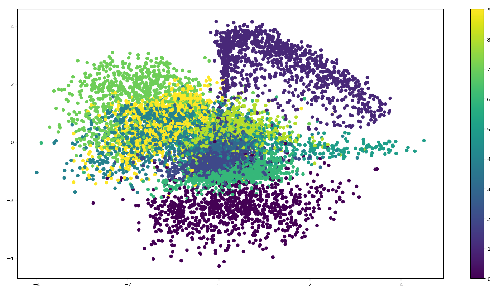

# Autoencoder

An **autoencoder** neural network is an unsupervised learning algorithm that applies backpropagation, setting the target values to be equal to the inputs. i.e. it uses $y^{(i)} = x^{(i)}$

The autoencoder tries to learn a function $h_{W,b}(x) = x$. In other words, it is trying to learn an approximation to the identity function, so as to output $\bar x$ that is similar to input $x$. The identity function seems a particularly trivial function to be trying to learn; but by placing constraints on the network, such as by *limiting the number of hidden units*, we can discover very interesting structure about the data (dimensionality reduction).

In short, the simple autoencoder often ends up learning a low-dimensional representation very similar to PCAs.

Following this [tutorial](http://kvfrans.com/variational-autoencoders-explained/), we will first start from a simple network and add parts step by step.

> A common way of describing a neural network is an approximation of some function we wish to model. Alternatively, they can also be considered as a data structure that holds information, **very interesting information**.

Given the above flowchart, we have a network comprised of a few deconvolution layers. We set the input to always be a vector of ones. Then, we can train the network to reduce the *mean squared error* between itself and one target image. The "**data**" for that image is now contained within the network's parameters.

After scaling to multiple images, we use a one-hot vector for the input. [1, 0, 0, 0] for instance, could represent a cat image, while [0, 1, 0, 0] could represent a dog image. To let the network memorize different images, we use a vector of real numbers instead of a one-hot vector.

Choosing the latent variables randomly is obviously a bad idea. In an autoencoder, we add in another component that takes the original images and encodes them into vectors for us. The deconvolutional layers then "decode" the vectors back to the original images.

We have finally reached a stage where our model has some hint of a practical use. We can train our network on as many as images we want. If we save the encoded vector of an image, we can reconstruct it later by passing it into the decoder portion. What we have here is the standard autoencoder.

## Variational Autoencoder

A **variational autoencoder** (**VAE**) resembles a classical autoencoder and is a neural network consisting of an encoder, a decoder, and a loss function.

The problem of the standard autoencoder is its incapability in generalisation. We can't generate anything yet, since we don't know how to create latent vectors other than encoding them from images.

There is [a simple solution](https://arxiv.org/pdf/1312.6114.pdf). We add a constraint on the encoding network, forcing it to generate latent vectors, which roughly follow a unit Gaussian distribution. It is the constraint that separates a variational autoencoder from a standard one.

## Results & Discussion

## Reference

1. https://github.com/llSourcell/autoencoder_explained/blob/master/variational_autoencoder.py
2. http://kvfrans.com/variational-autoencoders-explained/