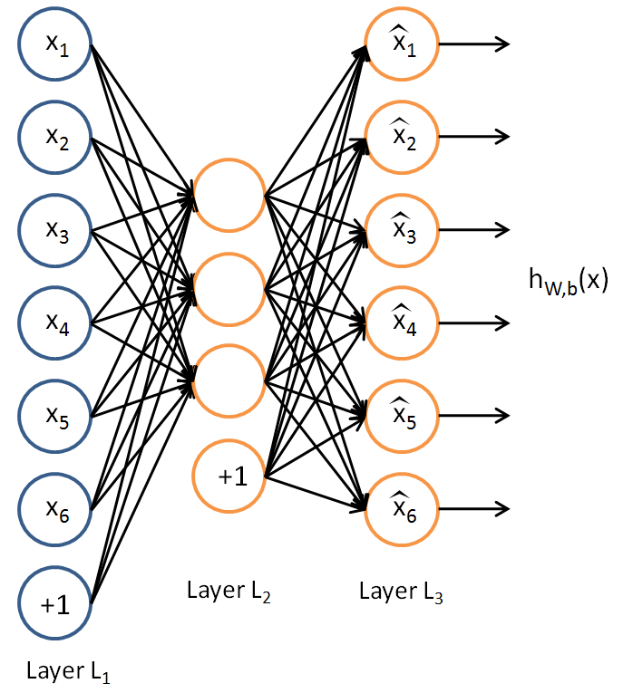
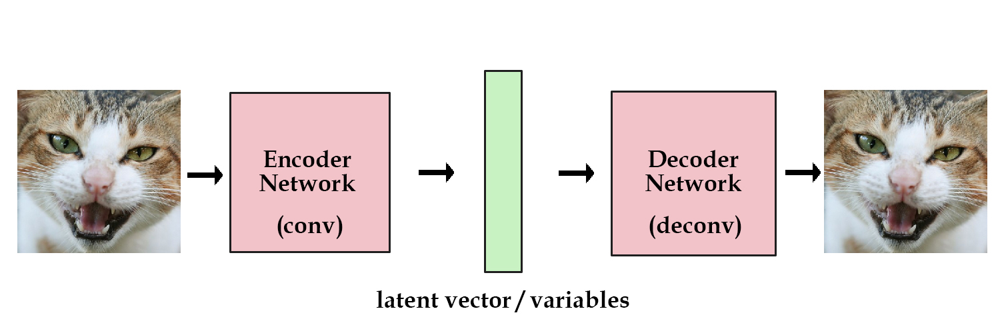
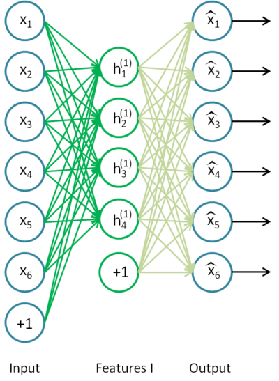
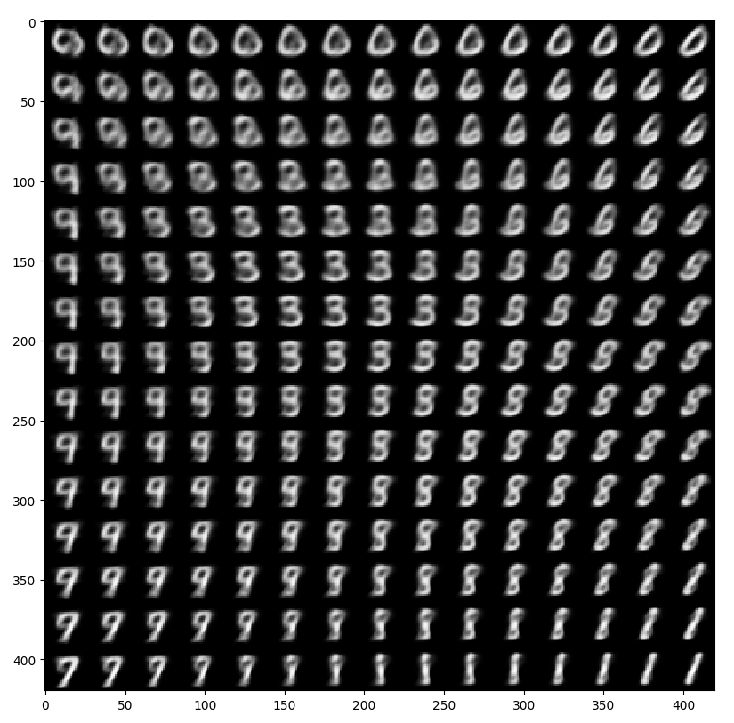

# Autoencoder

The **autoencoder** neural network is commonly used for **feature selection** and **extraction**. An autoencoder neural network is an unsupervised learning algorithm that applies backpropagation, setting the target values to be equal to the inputs. i.e. it uses $y^{(i)} = x^{(i)}$



The autoencoder tries to learn a function $h_{W,b}(x) = x$. In other words, it is trying to learn an approximation to the identity function, so as to output $\bar x$ that is similar to input $x$. The identity function seems a particularly trivial function to be trying to learn; but by placing constraints on the network, such as by *limiting the number of hidden units*, we can discover very interesting structure about the data (dimensionality reduction).

In short, the simple autoencoder often ends up learning a low-dimensional representation very similar to PCAs.


Following this [tutorial](http://kvfrans.com/variational-autoencoders-explained/), we will first start from a simple network and add parts step by step.

> A common way of describing a neural network is an approximation of some function we wish to model. Alternatively, they can also be considered as a data structure that holds information, **very interesting information**.


Given the above flowchart, we have a network comprised of a few deconvolution layers. We set the input to always be a vector of ones. Then, we can train the network to reduce the *mean squared error* between itself and one target image. The "**data**" for that image is now contained within the network's parameters.

After scaling to multiple images, we use a **one-hot vector** for the input. [1, 0, 0, 0] for instance, could represent a cat image, while [0, 1, 0, 0] could represent a dog image. To let the network memorize different images, we use a vector of real numbers instead of a one-hot vector.

Choosing the latent variables randomly is obviously a bad idea. In an autoencoder, we add in another component that takes the original images and encodes them into vectors for us. The deconvolutional layers then "decode" the vectors back to the original images.



We have finally reached a stage where our model has some hint of a practical use. We can train our network on as many as images we want. If we save the encoded vector of an image, we can reconstruct it later by passing it into the decoder portion. What we have here is the **standard/basic** *autoencoder*.


## Deep Autoencoder

The extension of the basic autoencoder is the **deep autoencoder**, which have more hidden layers.


The additional hidden layers enable the autoencoder to learn mathematically more complex underlying patterns in the data. The first layer of the deep autoencoder may learn first-order features in the raw input (such as edges in an image). The second layer may learn second-order feature corresponding to patterns in the appearance of the first-order features (e.g. in terms of what edges tend to occur together, to form contour ot corner detectors). Deeper layers of the deep autoencoder tends to learn even higher-order features.

## Stacked Autoencoders

> How autoencoders can be stacked in a greedy layer-wise fashion for pre-training (or initializing) the weights of a deep network.

A stacked autoencoder is a neural network consisting of multiple layers of sparse autoencoders in which the outputs of each layer is wired to the inputs of the successive layer.

Formally, consider a stacked autoencoder with $n$ layers. Let $W^{(k,1)},W^{(k,2)},b^{(k,1)},b^{(k,2)}$ denote weights and biases for $k$th autoencoder. Then the encoding step for the stacked autoencoders is given by running the encoding step of each layer in forward order. 

$a^{(l)} = f(z^{(l)})$

$z^{(l+1)} = W^{(l,1)}a^{(l)} + b^{(l,1)}$

The decoding step is given by running the decoding stack of each autoencoder in reverse order. 

$a^{(n+l)} = f(z^{(n+l)})$

$z^{(n+l+1)} = W^{(n-l,2)}a^{(n+l)} + b^{(n-l,2)}$

The information of interest is contained within $a^{(n)}$, which is the **activation** of the deepest layer of hidden units. This vector gives us a representation of the input in terms of higher-order features. The features from the stacked autoencoder can be used for classification problems by feeding $a^(n)$ to a softmax classifier.

**training**

A good way to obtain good parameters for a stacked autoencoder is to use greedy layer-wise training. The first layer is used to transform the raw input into a vector consisting of activation of the hidden units, on which the second layer is used to train. Repeat for subsequent layers, using the output of each layer as input for the subsequent layer. This models trains the parameters of each layer individually while freezing parameters for the remainder of the model.

First, you would train a sparse autoencoder on the raw inputs $x^{(k)}$ to learn primary features $h^{(1)(k)}$ on the raw input.



Next, you would feed the raw input into this trained sparse autoencoder, obtaining the primary feature activations $h^{(1)(k)}$ for each of the inputs $x^{(k)}$. You would then use these primary features as the "raw input" to another sparse autoencoder to learn secondary features $h^{(2)(k)}$  on these primary features.


Finally, you would combine all three layers together to form a stacked autoencoder with 2 hidden layers and a final softmax classifier layer capable of classifying the MNIST digits as desired.


**discussion**

A stacked autoencoder enjoys all the benefits of any deep network of greater expressive power. Further, it often captures a useful 'hierarchical grouping' or 'part-whole decomposition' of the input. To see this, recall that an autoencoder tends to learn features that form a good representation of its input.. The first layer of a stacked autoencoder tends to learn first-order features in the raw input. The second layer of a stacked autoencoder tends to learn second-order features corresponding to patterns in the appearance of first-order features. Higher layers of the stacked autoencoder tend to learn even higher-order features.


## Variational Autoencoder

A **variational autoencoder** (**VAE**) resembles a classical autoencoder and is a neural network consisting of an encoder, a decoder, and a loss function.

The problem of the standard autoencoder is its incapability in **generalisation**. We can't generate anything yet, since we don't know how to create latent vectors other than encoding them from images.

There is [a simple solution](https://arxiv.org/pdf/1312.6114.pdf). We add a constraint on the encoding network, forcing it to generate latent vectors, which roughly follow a *unit Gaussian distribution*. It is the constraint that separates a variational autoencoder from a standard one.

In practice, there is a tradeoff between how accurate our network can be and how close its latent variables can match the unit gaussian distribution.

This constraint forces the encoder to be very efficient, creating information - rich latent variables. This improves generalization, so latent variables that we either randomly generated, or we got from encoding non-training images, will produce a nicer result when decoded.

**Results**





## Denoising Autoencoder

When there are **more** nodes in the hidden layer than the inputs, the autoencoder network is risking to learn the so-called "Identity Function", meaning that the output equals the input, marking the autoencoder *useless*.

Denoising autoencoders solve this problem by **corrupting the data on purpose by randomly turning some of the input values to zero**. In general, the percentage of input nodes which are being set to zero is about *50%*. Other sources suggest a lower count, such as 30%. It depends on the amount of data and input nodes you have.


When calculating the *Loss* function, it is important to compare the output values with the **original input**, not with the corrupted input. The risk of learning the identity function instead of extracting features is therefore eliminated.


## LSTM Autoencoder

An LSTM Autoencoder is an implementation of an autoencoder for sequence data using an **Encoder-Decoder LSTM architecture**. For a given dataset of sequence, an encoder-decoder LSTM is configured to read the input sequence, encode it, decode it, and reconstruct it. The performance of the model is evaluated based on the model's ability to reconstruct the input sequence. 


Once the model achieves a desired level of performance reconstructing the sequence, the decoder part of the model may be removed, leaving just the encoder model. This model can then be used to encode input sequences to a *fixed-length* vector.

The resulting vectors can then be used in a variety of applications, not least as a compressed representation of the sequence as an input to another supervised learning model.

[Unsupervised Learning of Video Representations using LSTMs](https://arxiv.org/abs/1502.04681)
> The input to the model is a sequence of vectors (image patches or features). The encoder LSTM reads in this sequence. After the last input has been read, the decoder LSTM takes over and outputs as prediction for the target sequence.

> The target sequence is same as the input sequence, but in reverse order. Reversing the target sequence makes the optimization easier because the model can get off the ground by looking at low range correlations.

> The decoder can be of two kinds - conditional and unconditional. A conditional decoder receives the last generated output frame as input. An unconditional decoder does not receive the input.

> Reconstructing the input and predict the future can be combined to create a composite LSTM autoencoder. Here the autoencoder LSTM is asked to come up with a state from which we can both predict the next few frames as well as reconstruct the input.

### reconstruction

The simplest LSTM autoencoder is the one that learns to reconstruct each input sequence.


### prediction

Instead of reconstructing the original input sequence, the LSTM autoencoder can be modified to predict the next step in the sequence.

```model.fit(seq_in, seq_out, epochs=300, verbose=1)```


### composite

A composite LSTM autoencoder has one single encoder and two decoders, one for reconstruction and one for prediction. While training, two decoders (or two targets) are fitted simultaneously.


### standalone encoder

Regardless of the method chosen (reconstruction, prediction, or composite), once the autoencoder has been fit (trained), the decoder part can be removed the encoder part can be kept as a standalone model.


## Convolutional Autoencoder

The main idea behind autoencoders is to reduce the input into a latent state-space with fewer dimensions and then try to reconstruct the input from this representation. The first part is called encoding and the second step is the decoding. 

One of the interesting parts of this implementation is the use of **upsampling**. Inverting the convolutional layer can be rather challenging due to the overlap of the kernels. Most of deep learning frameworks include deconvolution layers (or transposed convolution layers) which is an inverted convolutional layer. Even though these layers intuitively make sense in reconstructing the input, they come with the disadvantage of generating checkerboard artifacts. To overcome this issue, they have been replaced by **upsampling** and simple convolutional layers. 

[Deconvolution and Checkerboard Artifacts](https://distill.pub/2016/deconv-checkerboard/)
[Upsampling with Transposed Convolution](https://towardsdatascience.com/up-sampling-with-transposed-convolution-9ae4f2df52d0)


## notes

> How to use the GPU in keras implementation?

If you are running on the **TensorFlow** or CNTK backends, your code will *automatically* run on GPU if any available GPU is detected.

> dimension of input layer **VS** dimension of hidden layer 

In (LSTM) autoencoder, the #input (kind of) should be less than #hidden (like) 3 times. Otherwise, the loss would get stuck in the local minimum, or there is no gradient (vanishing).

## Reference

1. https://github.com/llSourcell/autoencoder_explained/blob/master/variational_autoencoder.py
2. http://kvfrans.com/variational-autoencoders-explained/
3. https://towardsdatascience.com/denoising-autoencoders-explained-dbb82467fc2
4. 