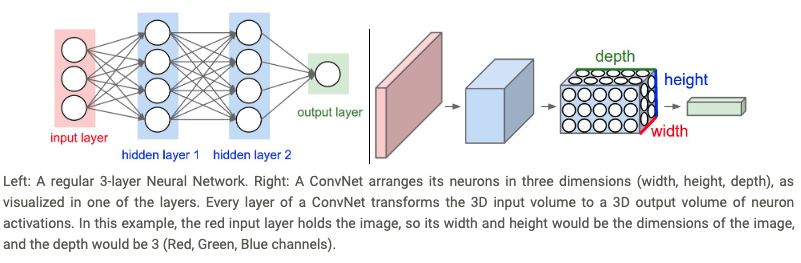
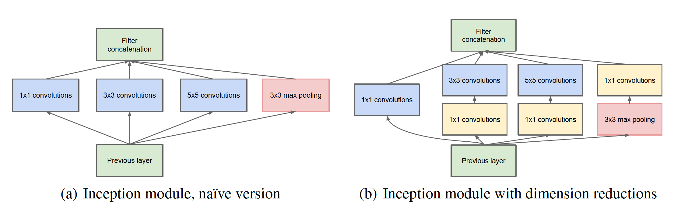

# Inception

[Inception](https://arxiv.org/pdf/1409.4842.pdf) is a deep convolutional neural network architecture that was introduced for the first time in 2014. It won the ImageNet Large-Scale Visual Recognition Challenge (ILSVRC14). It was mostly developed by Google researchers. **Inception** architecture can be used in computer vision tasks that imply convolutional filters.

## CNNs

In Convolutional Neural Networks (CNNs), most work is to choose the right layer to apply, among the most common options (1\*1 filter, 3\*3 filter, 5\*5 filter or maxpooling). We need to find the optimal local construction and repeat it spatially.

According to [CS231n](http://cs231n.github.io/convolutional-networks/)'s summary:
* A ConvNet architecture is in the simplest case a list of *Layers* that transform the image volume into an output volume.
* There are a few distinct types of *Layers*, e.g. CONV/FC/RELU/POOL are by far the most popular.
* Each *Layer* accepts an input 3D volume and transforms it to an output 3D volume through a differentiable function
* Each *Layer* may or may not have parameters, e.g. CONV/FC do, RELU/POOL do not.
* Each *Layer* may or may not have additional hyperparameters, e.g. CONV/FC/POOL do, RELU does not.

Here is how convolutional operation works:

## Inception module

(a) As these **Inception modules** are stacked on top of each other, their output correlation statistics are bound to vary: as features of higher abstraction are captured by higher layers, their spatial concentration is expected to decrease suggesting that the ratio of 3\*3 and 5\*5 convolutions should increase as we move to higher layers.

(b) The computational cost of such solution, however, increases highly. Dimension reduction through 1\*1 convolutions are used as dimension reduction techniques.

## GoogLeNet

The most famous Inception-based algorithm is GoogLeNet, which corresponds to the team name of Google's team in ILSVRC14. 

The full architecture refers to Figure 3 in their [work](https://arxiv.org/pdf/1409.4842.pdf).

