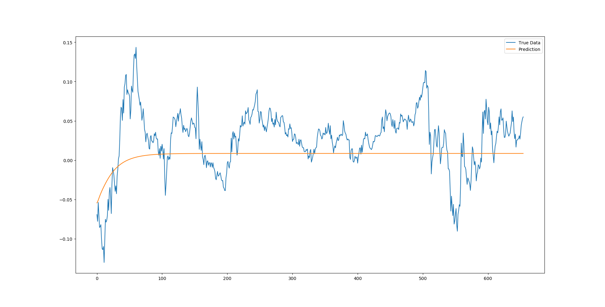
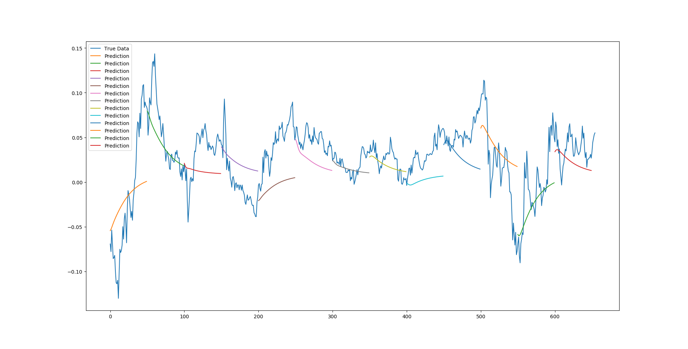
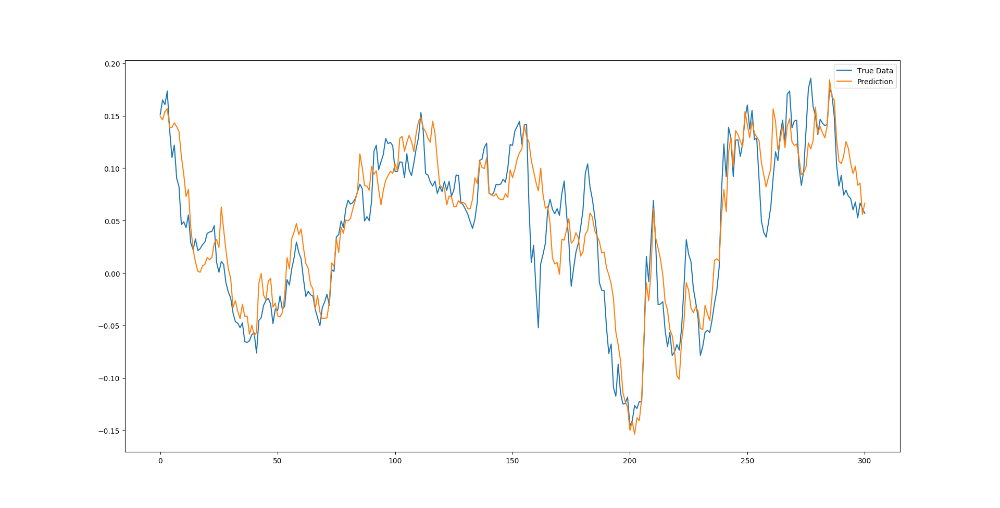
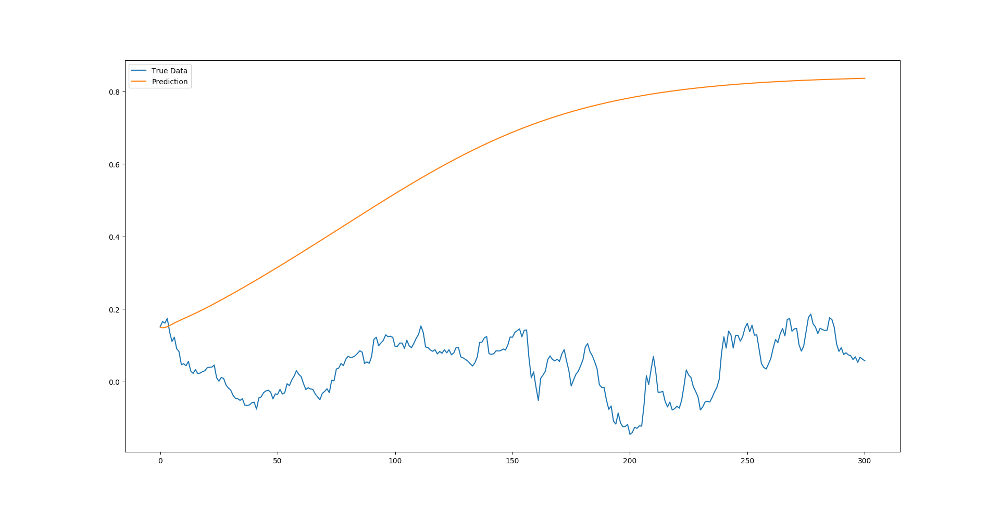
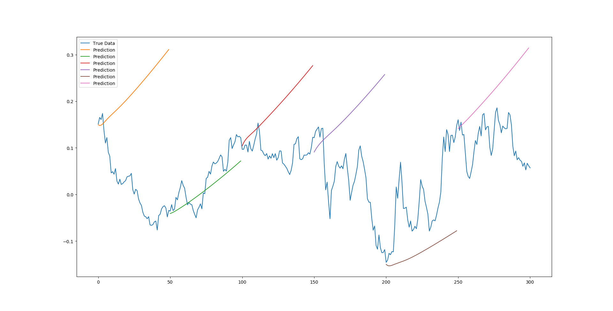

# LSTM Recurrent Neural Network coding practical

This practical focuses on using a Deep LSTM Neural Network architecture to provide multidimensional time series forecasting using [Keras](https://keras.io/) and TensorFlow. Unlike a sinewave, a stock market series is not any sort of specific static function which can be mapped. The best property to describe the motion of a stock market time series would be a random walk. As a stochastic process, a true random walk has no predictable patterns and so attempting to model it would be pointless. Fortunately there are on-going arguments by many sides to say that a stock market is not a pure stochastic process, which allows us to theorize that the time series may well have some kind of hidden pattern, and these hidden patterns can possibly be predicted by LSTM deep networks.

## dataset

The data this example will be using is the sp500.csv file in the data folder. This file contains the Open, High, Low, Close prices as well as the daily Volume of the S&P 500 Equity Index from January 2000 to September 2018.

normalization: $n_i = (p_i / p_0) - 1$

de-normalization: $p_i = p_0(n_i + 1)$

where $n$ is the normalized list [window] of price changes and $p$ is the raw list [window] of adjusted daily return prices.


## generator

Instead of using the framework's ```model.train()``` method, we are instead using the ```model.train_generator()``` method. The reason why is that we have found that it is easy to run out of memory when trying to train large datasets, as the ```model_train()``` function loads the full dataset into the memory, and then applies the normalizations to each window in-memory, easily causing a **memory overflow**. So instead, we utilize the ```fit_generator()``` function in Keras to allow for dynamic training of the dataset using a python generatorto draw the data, which means memory utilization will be minimized dramatically. 

## results


SP500 point-by-point prediction


SP500 full-sequence prediction


SP500 multi-sequence prediction


Google stock point-by-point prediction


Google stock full-sequence prediction


Google stock multi-sequence prediction


## note 
A *json* file is used as the external configuration file to indicate the data used and hyperparameters inside the LSTM RNN model. This technique provides the generalization of the model because model can be applied to other dataset or with other sets of hyperparameters without adjusting code. In addition, *json* files are very well supported in *Python*, so try to use this setup in the future work. 