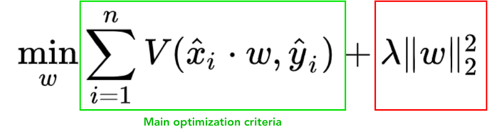
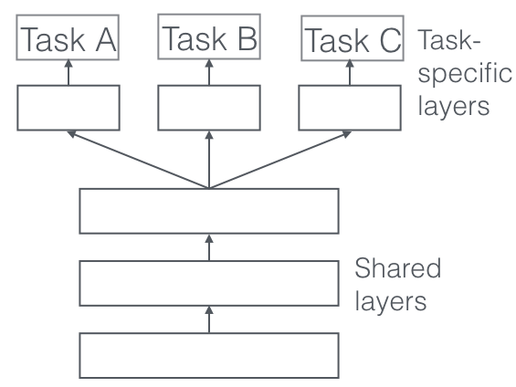

# Multitask Learning

Traditionally, modern neural networks (and other machine learning algorithms) usually solve one single problem from a single example -- it can be classification, regression, structured prediction, anomaly detection or even object generation. 

Here is the famous L2 regularization formula. It actually solves two optimization problems at the same time: minimization of loss function and making norm of our parameters *w* smaller. 

To try additional losses in the objective function gives us an architecture with a single input, several layers and numerous outputs. Apart of "regularization", learning a neural network to solve X problems at once instead of having X separate neural networks is simply much cooler from a plain engineering point of view, along with better performance, regularization and generalization. 

